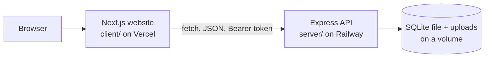
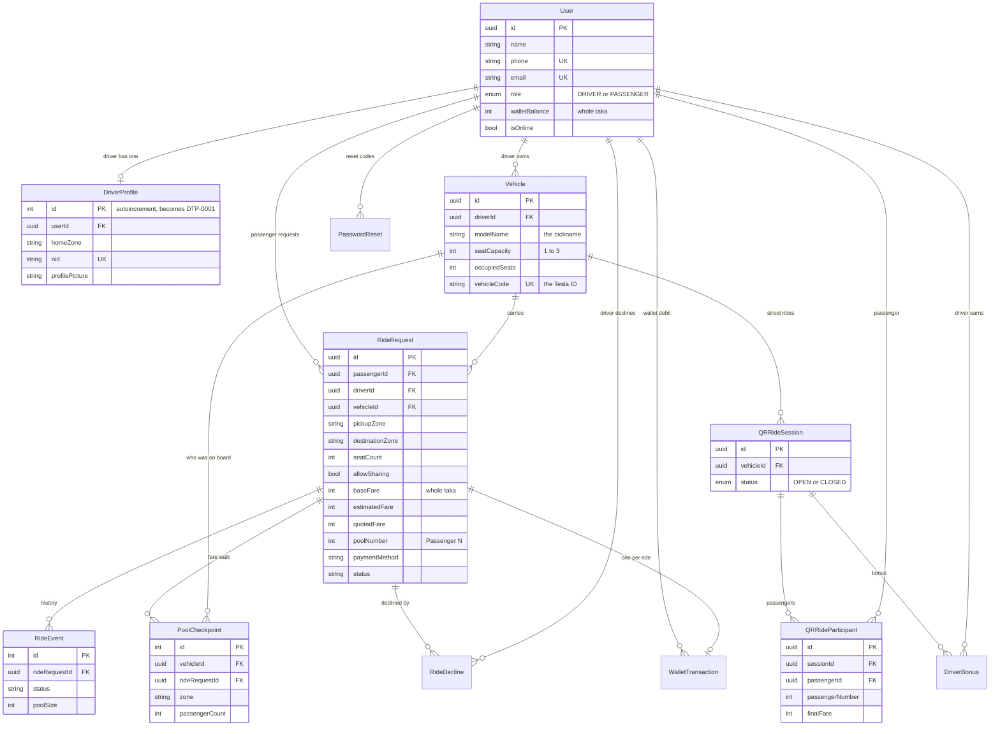

# Dhaka Tesla Pool

A ride-pooling app for battery rickshaws ("Teslas") in Dhaka. Passengers going the same way share one rickshaw and split the fare. The driver earns more than for one passenger.

- Website: https://dhaka-tesla-pool-psi.vercel.app
- API: https://dhakateslapool-production.up.railway.app (`/health` answers when it is up)
- Demo video: TODO add the link
- Longer design notes (pooling rules, fare worked examples, privacy, concurrency): [docs/design-notes.md](docs/design-notes.md)

## Summary and problem

Jashim mama drives "Bullet", a 3-seat rickshaw. It is rush hour in Banani. Nusrat, Rafiq and Shirin all want to go from Mohakhali to Badda. Each asks for a ride alone, so Jashim carries one person and the other two wait.

Dhaka Tesla Pool puts the three in Bullet together. Each pays less than they would alone. Jashim earns more in total. The app has to answer three questions correctly:

- Who may share a rickshaw? (same direction, seats free)
- What does each person pay?
- What happens when two people try to take the last seat at the same moment?

## Features

**Passenger**
- Sign up and log in with a Bangladesh mobile number. Reset a password with an SMS code (see limitations).
- Request a ride between 10 Dhaka zones, with 1 to 3 seats. Switch "Allow sharing" off for a private ride.
- See the fare before requesting: alone, and with 2 or 3 passengers.
- Pay by cash or by a simulated TeslaPay wallet.
- Follow the ride on a status page that refreshes every 5 seconds: driver, vehicle, Tesla ID, fare, the others in the car.
- Cancel before the trip, or leave a started trip at a zone you choose.
- Ride history with the final fare.
- Street Ride tab: join a rickshaw by its vehicle code (see below).
- English and Bangla, light and dark theme.

**Driver**
- Onboarding: vehicle nickname, seats (1 to 3), home zone, NID, optional photo. The app creates the driver ID (DTP-0001).
- Go online, see only the requests that fit the rickshaw, accept or decline.
- Run each ride: arrived, started, completed. Add passengers who fit while the trip is under way.
- See total earnings for the current pool, the pool history, and past rides.

**Pooling**
- A request is offered only to a driver whose rickshaw has the seats and is heading the same way.
- A started trip keeps taking compatible passengers.
- Everyone in a car is only "Passenger 1", "Passenger 2". No names or user ids are shown to drivers or co-passengers.

## Screenshots

TODO add screenshots or GIFs. Suggested set:
1. Landing and sign-up page
2. Passenger: Request Ride with the fare preview
3. Passenger: Active Ride with two other passengers
4. Driver: Pending Requests and Active Ride with earnings
5. Driver onboarding
6. Passenger: Street Ride tab and the trip in History

## Architecture



The browser only talks to the Next.js pages. The pages call the API directly with a login token. The API owns all rules (matching, fares, seats). SQLite is a single file, so there is one API instance.

## Database (ERD)



Small tables left out of the drawing for space: `RideDecline`, `WalletTransaction` (amount, balanceAfter), `PasswordReset` (codeHash, expiresAt), `DriverBonus` (amount). The schema is in `server/src/models/`.

## Tech stack

| Part | Choice | Why I chose it | Alternative |
|---|---|---|---|
| Frontend | Next.js 16, React 19, TypeScript | One project for pages, routing and the build; deploys to Vercel as is | Vite + React |
| Backend | Node.js, Express 5, TypeScript | Small and easy to read; one file per route group | Fastify, NestJS |
| Database | SQLite | One file, no server to install, and `BEGIN IMMEDIATE` gives a clear seat lock | PostgreSQL (needed at larger scale) |
| ORM | Sequelize 6 | Models, associations and transactions without writing every query; raw SQL where it matters (seat claim) | Prisma, Drizzle |
| Auth | Phone number + password (bcryptjs), JWT (24 hours) | No session store to run; the token carries id and role | Sessions in the database, Auth.js |
| Styling | Plain CSS (`globals.css`) and a small translation table | No extra build step; the app has one design | Tailwind CSS |
| Tests | Jest + supertest (API), Node test runner (client helpers) | supertest calls the real Express app with a throwaway database | Vitest |
| Hosting | Vercel (website), Railway (API + volume) | The API needs a disk for SQLite; Vercel cannot give one | Fly.io, a small VPS |

## Project structure

```
client/                Next.js website
  src/app/             pages: auth, passenger, driver, driver/onboarding, forgot-password
  src/components/      RideStatusCard, StreetRide, PoolTimeline, MidTripOffers, UI parts
  src/lib/             api client, translations (en, bn), preferences, error messages
server/                Express API
  src/routes/          auth, onboarding, vehicle, rideRequest, driver, passenger, qr
  src/models/          Sequelize models (the schema)
  src/services/        qrRides.ts (street rides)
  src/utils/           pooling, routeDirection, fareCalculator, checkpoints, seats, payments
  src/config/          jwtSecret.ts (no default secret)
  src/tests/           24 test files, about 500 tests
  src/migrations.ts    start-up migrations
  src/seed.ts          demo data (the story cast)
docs/design-notes.md   detailed design notes
docker-compose.yml     website + API for local Docker
```

## Prerequisites

- Node.js 20 or newer and npm
- Docker Desktop (only for the Docker route)
- `openssl`, or Node, to make a secret

## Environment variables

Copy `.env.example` to `.env` (root, for Docker) or to `server/.env` (local). Never commit the real file.

| Variable | Needed | Meaning |
|---|---|---|
| `JWT_SECRET` | yes | Signs login tokens and reset codes. At least 32 characters. The server refuses to start without it. Make one: `openssl rand -base64 32` |
| `PORT` | no | API port. Default 3001. |
| `NODE_ENV` | no | `production` on a host. |
| `DB_STORAGE_PATH` | no | SQLite file. Default `server/data/database.sqlite`. Uploads go in `uploads/` next to it. |
| `CORS_ORIGIN` | in production | Website address allowed to call the API, e.g. `https://dhaka-tesla-pool-psi.vercel.app`. Comma separated. Empty means any website. |
| `QR_SESSION_TIMEOUT_MINUTES` | no | Street ride auto-close. Default 90. |
| `RESET_CODE_IN_RESPONSE` | no | `true` returns the reset code in the API reply (demo only). |
| `NEXT_PUBLIC_API_URL` | website | API address, used when the website is built. Default `http://localhost:3001`. |

## Local setup

```
# terminal 1: API
cd server
cp ../.env.example .env        # then put your JWT_SECRET in server/.env
npm install
npm run seed                   # demo data. This DELETES everything in the database first.
npm run dev                    # http://localhost:3001

# terminal 2: website
cd client
npm install
npm run dev                    # http://localhost:3000
```

Migrations run by themselves every time the API starts. They add columns to an older database (`migrations.ts`) and create the indexes. `npm run seed` recreates all tables from scratch, so use it on an empty or throwaway database only.

## Docker

```
cp .env.example .env           # set JWT_SECRET in this root .env
docker compose up --build
```

Website on http://localhost:3000, API on http://localhost:3001. The database and photos are kept in `server/data/` on your machine. Compose stops with a message if `JWT_SECRET` is not set. To use another API address, set `NEXT_PUBLIC_API_URL` before building.

## Demo credentials

After `npm run seed`. All passwords are `password123`.

| Person | Role | Phone | Notes |
|---|---|---|---|
| Jashim mama | Driver | 01711000000 | Bullet, 3 seats, home zone Banani, ID DTP-0001 |
| Nusrat | Passenger | 01711000001 | Wallet ৳1000, pays by wallet |
| Rafiq | Passenger | 01711000002 | Wallet ৳500, pays cash |
| Shirin | Passenger | 01711000003 | Wallet ৳120 (too small for a ৳180 solo fare), pays by wallet |

The seed also creates a ride request from Mohakhali to Badda for each of the three. Log in as Jashim, go online, and accept them one by one to watch the fare change.

## Run the tests

```
cd server && npx jest          # about 500 tests, throwaway database per worker
cd client && npm test          # 24 tests: error messages, translations, helpers
```

What the tests prove (not coverage for its own sake):

| Rule | Where |
|---|---|
| Bullet's seats never go over capacity, even with simultaneous accepts | `pooling.test.ts`, `midTripPooling.test.ts`, `privateRides.test.ts` |
| Invalid status changes are refused (e.g. complete before start) | `ride.test.ts` |
| Pooled fares are right (Nusrat, Rafiq, Shirin; 2 and 3 riders) | `poolFare.test.ts`, `pricingModel.test.ts`, `roundingRule.test.ts` |
| One user cannot read or change another user's ride | `rideStatus.test.ts`, `requestRide.test.ts` |
| Cancellation rules (before trip, mid-trip, half of the quoted fare) | `midTripCancellation.test.ts`, `cancellationPricing.test.ts` |
| Two concurrent requests cannot corrupt pool capacity | `pooling.test.ts` (case F), `midTripPooling.test.ts` |
| Money is whole taka; wallet never goes negative | `moneyIntegrity.test.ts`, `payments.test.ts` |
| No name or user id reaches a driver or co-passenger | `anonymization.test.ts` |
| No default JWT secret; the server will not start without one | `jwtSecret.test.ts` |

## API overview

All routes except sign-up, login and password reset need `Authorization: Bearer <token>`.

| Area | Routes |
|---|---|
| Auth | `POST /auth/signup`, `/auth/login`, `/auth/forgot-password`, `/auth/reset-password`; `GET /auth/me` |
| Driver onboarding | `GET`, `POST /driver/onboarding` |
| Vehicle | `POST /vehicle`; `GET /vehicle/driver/:driverId` |
| Requests | `GET /ride-requests/zones`, `/estimate`, `/me`, `/pending`, `/:id/pool-info`; `POST /ride-requests`, `/:id/accept`, `/:id/decline` |
| Driver rides | `PUT /driver/:id/status`; `PATCH /driver/rides/:id/arrive`, `/start`, `/complete`, `/cancel`; `GET /driver/rides/active`, `/history`, `/pool`, `/timeline` |
| Passenger rides | `GET /passenger/wallet`, `/rides/active`, `/rides/history`, `/rides/:id`; `PATCH /passenger/rides/:id/cancel`, `/cancel-in-transit` |
| Street rides | `GET /qr/vehicles/:code`, `/qr/sessions/mine`, `/qr/sessions/:id`, `/qr/bonus`; `POST /qr/join`, `/qr/sessions/:id/arrived` |
| Health | `GET /health` |

Errors are JSON with an `error` message and often a `code` (for example `CAPACITY_EXCEEDED`, `ACTIVE_RIDE_EXISTS`).

## Deployment

- Website: https://dhaka-tesla-pool-psi.vercel.app (Vercel, root directory `client`, variable `NEXT_PUBLIC_API_URL`)
- API: https://dhakateslapool-production.up.railway.app (Railway, root directory `server`, a volume mounted at `/app/data`, variables `JWT_SECRET`, `NODE_ENV=production`, `DB_STORAGE_PATH=/app/data/database.sqlite`, `CORS_ORIGIN`)
- Config files: `server/railway.json`, `server/fly.toml` (Fly.io alternative), `docker-compose.yml`.
- Keep the API at one instance: SQLite is one file on one volume.

## Key decisions

### 1. Driver ID (DTP-0001)

Most battery rickshaws in Dhaka have no licence and no number plate, so there is nothing reliable to identify a driver or a vehicle. The app makes its own ID. When a driver finishes onboarding, a `DriverProfile` row is created. Its auto-increment number becomes the ID: row 1 is `DTP-0001`, row 2 is `DTP-0002`. The ID is not stored. It is calculated from the number every time it is shown.

Two drivers onboarding at the same moment cannot get the same ID, because the database hands out each number once. A `COUNT(*) + 1` would not guarantee that. The same ID is the vehicle code that passengers type for a street ride.

Onboarding asks for: vehicle nickname (2 to 30 characters), seats (1 to 3), home zone (one of the 10 zones), NID (10, 13 or 17 digits), and an optional photo (JPEG or PNG, up to 2 MB). The NID is only ever shown, masked, to the driver who owns it.

### 2. Fare model

All money is a whole number of taka. There are no decimals anywhere.

- **Base fare** of a trip: ৳100 + ৳20 for every km, for every seat. Mohakhali to Badda is 4 km, so ৳100 + 4 x 20 = ৳180 for one seat.
- **Sharing:** each stretch of road is split between the people in the rickshaw on that stretch, rounded up to a whole taka, plus a fixed ৳20 driver bonus for each person on a shared stretch.
- Everyone sharing a stretch pays the same amount. The extra taka from rounding up go to the driver.

Mohakhali to Badda, one seat each, all riding the whole way:

| People in Bullet | Each pays | Jashim earns |
|---|---|---|
| 1 | ৳180 | ৳180 |
| 2 (Nusrat, Rafiq) | 180 / 2 + 20 = ৳110 | ৳220 |
| 3 (Nusrat, Rafiq, Shirin) | 180 / 3 + 20 = ৳80 | ৳240 |

Passengers pay less than alone. Jashim earns more than for one passenger.

**Not locked at the start.** An earlier version used fixed rates (100%, 70%, 55%) and locked the fare when the ride started. That was replaced. The fare now follows who is actually in the rickshaw. The app records a checkpoint every time the number of people changes. A passenger's fare is final when their own trip ends, calculated stretch by stretch from the checkpoints. A person who boards alone and is joined later pays the solo price for the solo stretch and the shared price after. Before the trip ends, the fare on screen is an estimate.

Other fare rules:
- Leaving a started trip costs half of the fare the passenger was quoted when they boarded.
- A private ride is always the flat base fare, never split.
- Zone distances are consistent: going through a zone on the way never adds distance. Details and worked examples: [docs/design-notes.md](docs/design-notes.md).

### 3. Street Ride tab

**Why.** Many mamas also pick up people from the street who do not use the app, and many mamas have no smartphone. The app must still know those seats are taken. If it did not, it could match three app passengers into a rickshaw that already carries two street passengers.

**How it works (what the code does).** A rickshaw has a sticker with its vehicle code, the same as its Tesla ID (`DTP-0001`). The passenger opens the Street Ride tab and types the code (or scans the sticker, if the browser supports it). They choose pickup, destination and seats and join. The driver does nothing and needs no phone.

| Step | What happens |
|---|---|
| Join | The passenger joins the vehicle's open street ride, or opens one. This claims seats with the same function the app uses for accepts, so the car can never be over-booked across both flows. If the car is full, the join is refused. |
| While riding | The ride appears on the Active Ride page. Others in the car are "Passenger 1", "Passenger 2". |
| Fare | Same stretch-by-stretch formula as the app. Always cash. |
| Arrive | The passenger taps "I've arrived". Their seats are released and the fare is final. |
| Close | The ride closes when everyone has arrived, or after 90 minutes. The passengers who never tapped are charged as if they arrived. |
| History | The trip shows in the passenger's History, labelled as a street ride. |
| Driver earnings | The driver gets a fixed ৳10 bonus for each passenger after the first in a ride, saved in `DriverBonus` and read at `GET /qr/bonus`. |

**What it does not do.** A street passenger is not a normal ride request. App pools, checkpoints, fares and earnings never include them. The only shared thing is the vehicle's seat count. A person cannot be in an app ride and a street ride at the same time.

### 4. Concurrency: the last seat

Bullet has one seat left. Nusrat's and Shirin's requests are both fine for it. Two accept calls arrive at almost the same moment, and both would see "1 seat free".

What the code does (`POST /ride-requests/:id/accept`, `utils/seats.ts`):

1. The accept runs in one SQLite transaction started with `BEGIN IMMEDIATE`. SQLite then lets only one writer in. The second accept waits until the first finishes, then reads the new state.
2. The seat is taken with one conditional update:
   `UPDATE Vehicles SET occupiedSeats = occupiedSeats + :seats WHERE id = :vehicle AND seatCapacity >= occupiedSeats + :seats`.
   Check and change are one statement. If no row changes, there was no seat. The transaction rolls back and the loser gets `409 Not enough seats available`. Their request stays open for another driver.
3. The ride is claimed with `WHERE status = 'REQUESTED'`, so two drivers cannot both accept the same request.
4. Seats, status, fare and history are saved together or not at all.

The same pattern protects the street ride join, completing a ride at the moment the passenger leaves, and the wallet (`WHERE walletBalance >= fare`). The tests fire both requests at once with `Promise.all` and check that exactly one wins.

**At larger scale.** Move to PostgreSQL. Locks become per row, so different vehicles run in parallel. The conditional update stays the same. Add a database `CHECK` so seats can never go over capacity. Retry deadlocks and send an idempotency key with each request. Do not add Redis locks for seats. The row lock plus the conditional update is already enough. More in [docs/design-notes.md](docs/design-notes.md).

## Assumptions

- **Zones, not maps.** Ten fixed zones with set distances in km. No GPS, no map service, no live location.
- **NID is not verified.** Only its format (digits, 10, 13 or 17 long) and uniqueness are checked.
- **No real payment.** Cash is only recorded. The TeslaPay wallet is a number in the database. A wallet that is too small fails and the fare is marked for cash.
- **Polling, not websockets.** The status page refreshes every 5 seconds.
- **No SMS gateway.** Password reset codes are created but not sent. Outside production the API returns the code so the flow can be tried.
- **Seat limit is 3 per rickshaw** and a booking takes 1 to 3 seats.
- **One city, one currency.** Dhaka zones, whole taka.
- **The vehicle code on the sticker is not a secret.** Anyone who knows it can join a street ride, but only as a passenger with an account.

## Known limitations

- SQLite means one API instance and a lock for the whole file. Under heavy load a request can fail with a "try again" error. Seats are never over-booked when that happens.
- Pre-trip cancellations by the passenger and the driver at the same instant are not fully guarded yet. The seat release cannot go below zero, but it could free a seat someone else holds. The complete and leave routes already use the stronger pattern.
- Driver photos are stored on the server's disk, not in object storage.
- There is no rate limiting and no admin screen.
- Server error messages are in English only. The website itself has English and Bangla.
- The seed script deletes the whole database. It is for demo data only.
- The pending request list is not locked, so it can show a request another driver takes a moment later. Accepting is what decides.
- A forgotten password cannot be reset in production until an SMS provider is added.
- Not tested by me in a browser on a phone: the camera scan on the Street Ride tab.

## Next improvements

- PostgreSQL, so the API can run on more than one instance.
- Websockets or server-sent events instead of polling.
- A real SMS provider and a real payment provider.
- NID check and an admin screen to approve drivers.
- Rate limiting, and a database `CHECK` on seat counts.
- Closing the pre-trip cancellation gap above.
- Real map distances and live location instead of fixed zones.
- Continuous integration that runs the tests on every push.

## AI usage

TODO write this section in your own words before submitting. A draft that matches the repository:

- An AI coding assistant was used to write most of the code, the tests and the documentation in this repository, working in the terminal, branch by branch. The git history shows the work in small commits.
- The product decisions came from me: the story (Jashim, Bullet, Nusrat, Rafiq, Shirin), the pooling and fare rules, the street ride idea, private rides, the cancellation rule, and what to deploy where.
- TODO name the tool or tools, and say what you checked yourself, what you changed or rejected, and how you verified the results.
